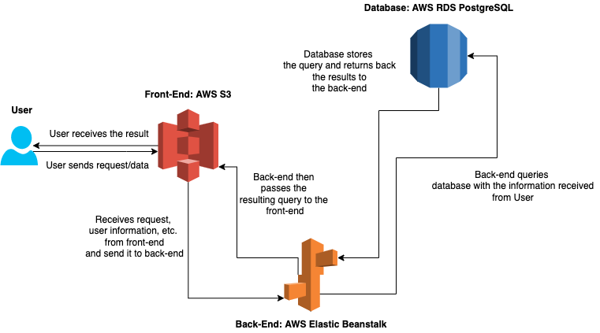

# Infrastructure

Udagram is a full-stack application which is developed by using Angular in the front-end and Express in the back-end. Front-End application named as udagram-frontend is stored in AWS S3 bucket and back-end named as udagram-api is stored in AWS Elastic Beanstalk environment. The database is stored in AWS RDS PostgreSQL.

